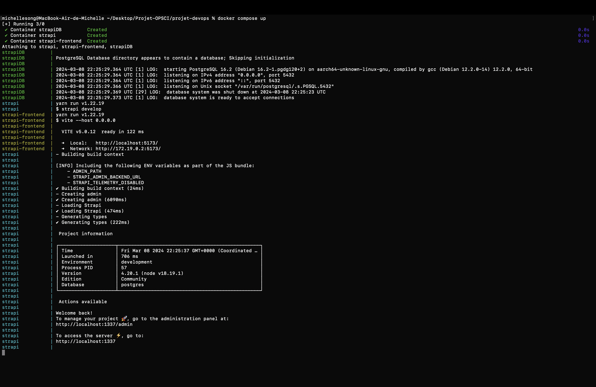

# Projet de conteneurisation et deploiement d'une application web

## Auteurs

- Michelle SONG 21106878 ([@misoop](https://github.com/misoop))
- Camelia BOUALI 21108238 ([@cmla16](https://github.com/cmla16))

## Script

Pour démarrer l'application, éxécuter : 

### `docker compose up`

Ou alors, éxécuter le fichier script.sh qui est fourni.

Ouvrir http://localhost:5173 pour voir dans le navigateur.
Pour accéder à l'API Strapi, ouvrir http://localhost:1337.

## Informations

Il y a en tout 3 conteneurs permettant d'activer l'application :
- postgres : contenant la base de données PosgreSQL qu'utilise notre projet Strapi
- strapi : contenant le projet Strapi
- strapi-frontend : contenant la partie front de l'application

## Demo

Vous pouvez trouver le screencast présentant brièvement les codes et les différentes fonctionnalités de l'application dans le fichier screencast-final.mov

## Sreenshots et logs

